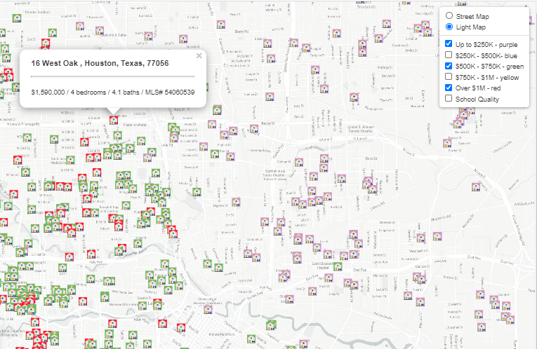
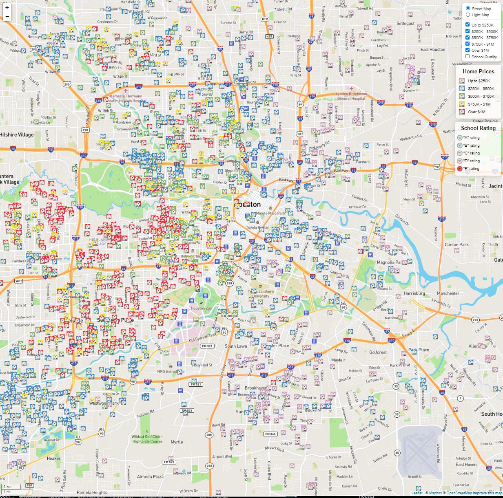

<html>

            
<body>

The project provides a visualization of GeoJSON real estate data utilizing Leaflet, JavaScript, Mapbox, and deployed utilizing Flask and Heroku.

Data was sourced from the Houston Association of REALTORS® and downloaded as a .csv.<a href="https://www.HAR.com"> Visit HAR.</a>

Real Estate data lends itself naturally to maps and the downloaded data required transformation in Python and Jupyter Notebook to obtain a list of full addresses suitable for geocoding.  The geocoding was performed in Jupyter Notebook using Geopy and is a hour+ run. The code is commented out to allow code blocks to run in a reasonable time frame. Once geocoded the dataframe was saved as [a clean .csv file.](static/data/final_HAR_df.csv)  was converted to a GeoJSON file.  

  
 

<a href="https://danawoodruff.github.io/Leaflet-challenge/">View GitHub-Page.</a> 
The opacity of the bubbles allow the user to identify multiple earthquakes that are overlapped.

The chart initially loads visualizing a street map view with earthquake events but the user has the option to select a satellite view.
The radius of the circular marker indicates its magnitude while the color indicates the depth of the earthquake origin in kilometers.

Users may view code at the following links:

To view the JavaScript code: [JavaScript Code](static/js/logic.js)     //Add link location
To view the HTML code: [HTML Code](index.html)                          //Add link location
To view the CSS code: [CSS code](static/css/style.css)
                 //Add link location

 

</body>
</html>
