<html>

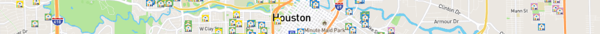
            
<body>

<h2>Real Estate Dashboard - with user interactivity</h2>
The project provides a visualization of GeoJSON real estate data utilizing Leaflet, JavaScript, Mapbox, and deployed utilizing Flask and Heroku.

<h3>Data</h3>
Data was sourced from the Houston Association of REALTORS® and downloaded as a .csv.<a href="https://www.HAR.com"> Visit HAR.</a>

Real Estate data lends itself naturally to maps and the downloaded data required transformation in Python and Jupyter Notebook to obtain a list of full addresses suitable for geocoding.  The geocoding was performed in Jupyter Notebook using Geopy and is a hour+ run. The code is commented out to allow code blocks to run in a reasonable time frame. Once geocoded the dataframe was was converted and saved as a [GeoJSON file](static/data/har.geojson).

After the visualization was built the data source was routed to the SQL database via [Jupyter Notebook.](static/ETL/Master-github.ipynb).  Python code was added to a [datalayer file.](datalayer.py) to convert to GeoJson, and a route created for the converted data in an [app.py file](app.py). This route is used by two visualizations.  

<kbd>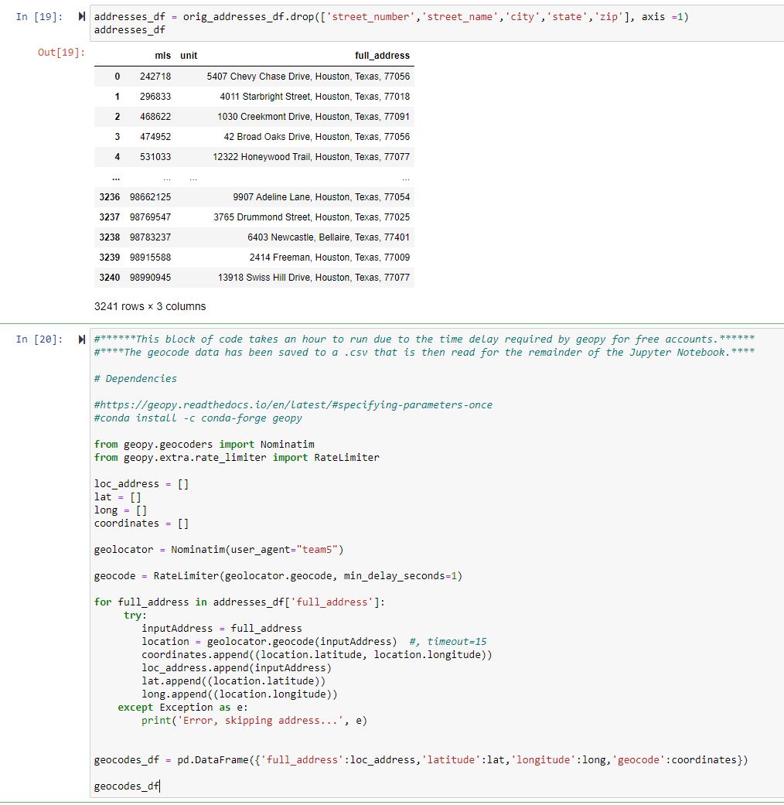</kbd>
  
The Geojson data as viewed in a JSON viewer:

<kbd>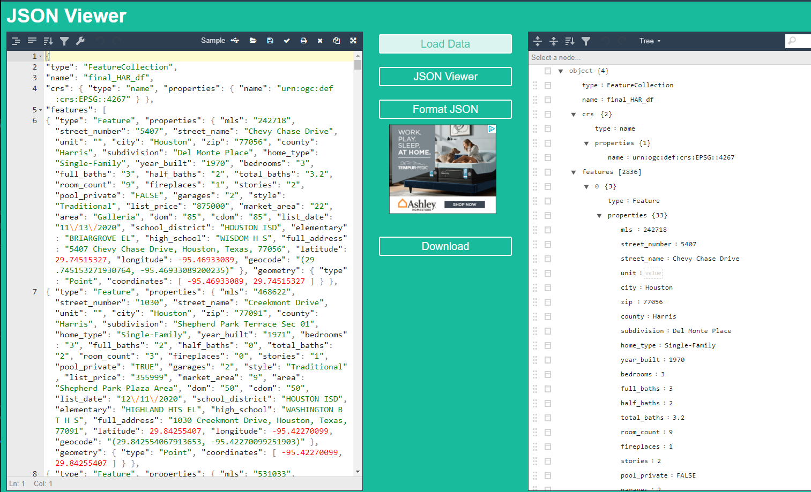</kbd>
  
Routes and functions from [app.py](app.py) and [datalayer.py.](datalayer.py):

<kbd>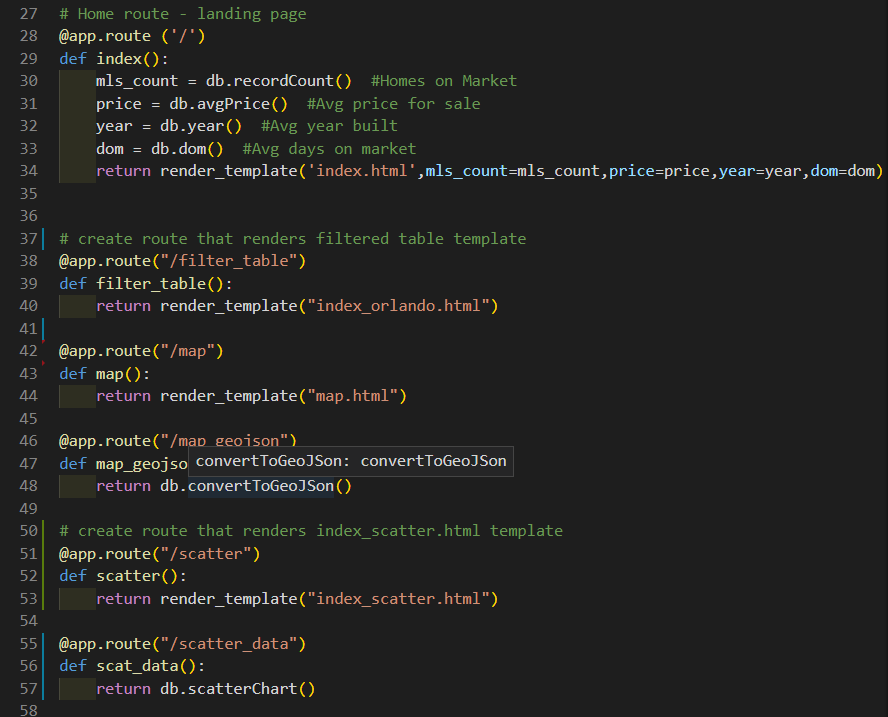</kbd> 
<kbd>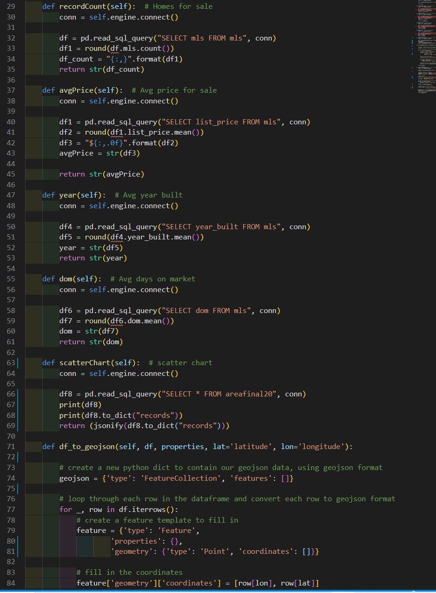</kbd>

  
<h3>Landing Page Dashboard with an Interactive Scatter Chart</h3> 
The dashboard has a landing page with five visualizations and additional visualizations are accessed from a collapsing navigation bar on the left of the page.

Four small boxes across the top of the page pull summary data from SQL.  In [datalayer.py](datalayer.py) functions are created to extract data from SQL and perform the mathematical operations of count and average. Data is formatted in the function to provide an attractive experience for the user. A scatter chart allows the user to explore different combinations of data metrics.

<kbd>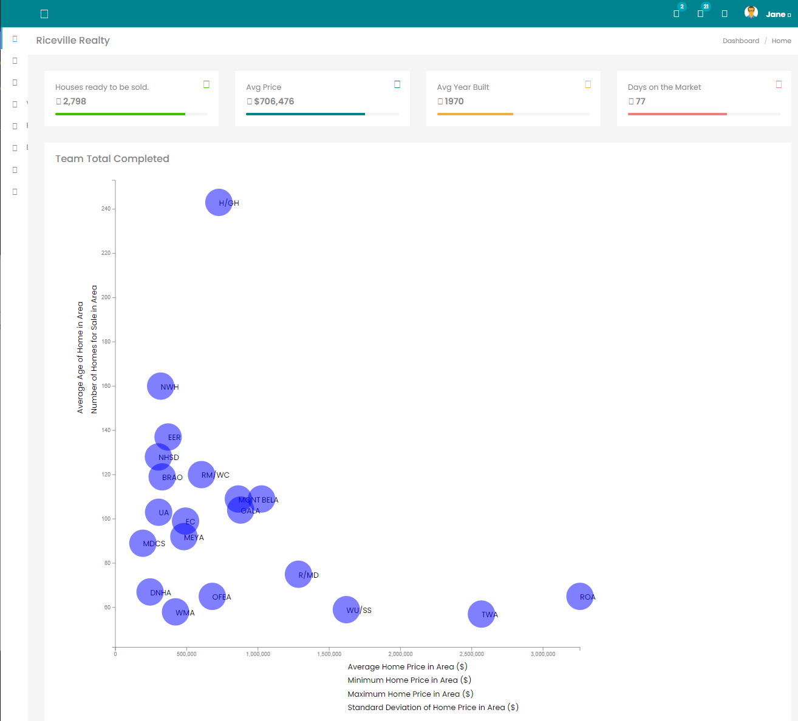</kbd>

<h3>Interactive Map Visualization</h3> 
The language JavaScript was used to code the primary map.  Using Leaflet the geojson file was read.  Street Map and Light Map layers were coded utilizing mapbox. These two layers are the base layers for the map and the user may choose which view they prefer.  Five layers were produced to create price bands for homes. The user may select one or more of the price bands to populate the map.  

<kbd>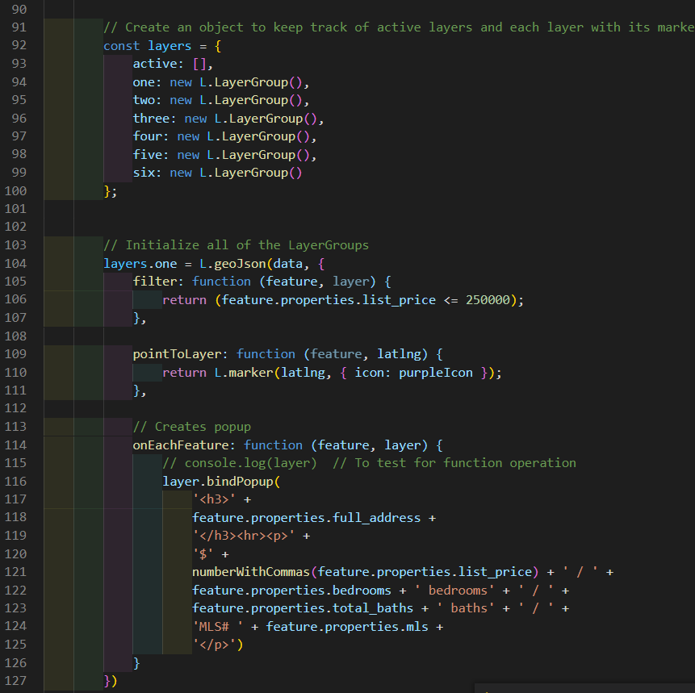</kbd>
  
Custom icons were designed to color the homes of each price band differently.  When clicking on a home a popup displays the home's address, list price, number of bedrooms, and MLS number.

<kbd>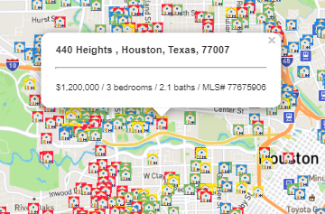</kbd>&nbsp;&nbsp;<kbd>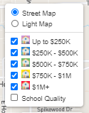</kbd>

A sixth layer was coded to create a quasi heatmap of school quality and density of homes for sale. When the user activates the button "School Quality" the home locations will produce a circle marker colored to represent the school's rating by the state of Texas. 

<kbd>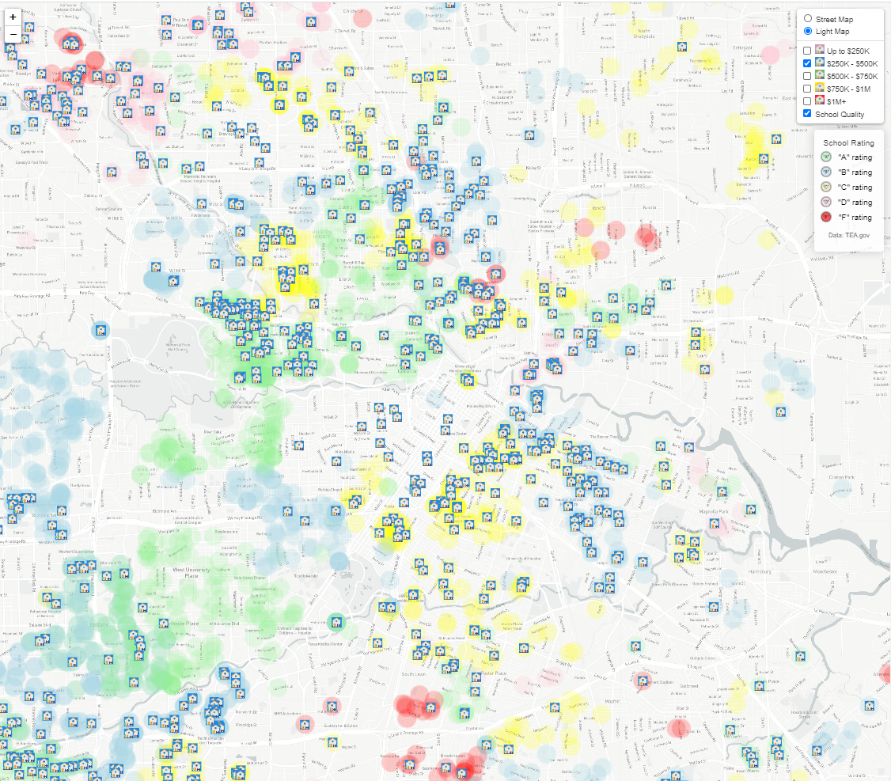</kbd>
  
The chart initially loads visualizing a street map view with all home price bands selected. 

<kbd>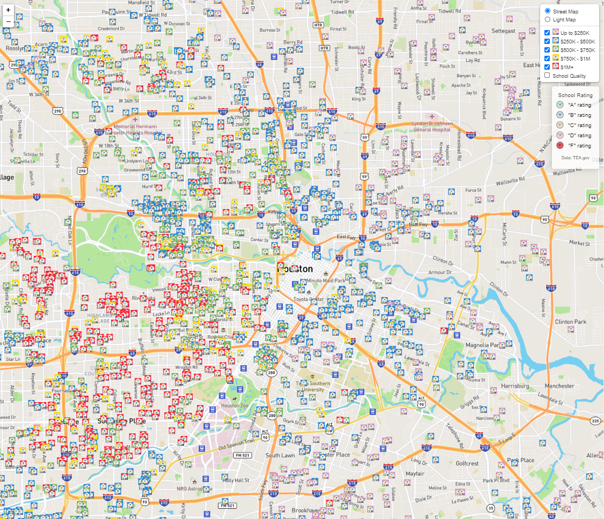</kbd>

<h3>Interactive Data Table</h3> 
The same geojson route was used to populate a table that allows the user to filter a list of homes by different metrics, e.g. zip code or to simply view the entire list of homes.

<kbd>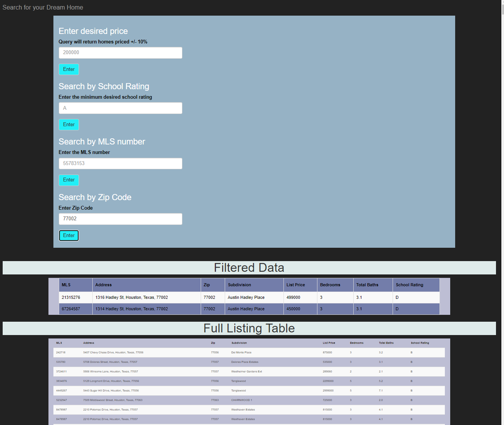</kbd>
  

Users may view code at the following links:

To view the JavaScript code: [JavaScript Code](static/js/)   
To view the landing pageHTML code: [HTML Code](templates/index.html)                       
To view the CSS code: [CSS code](static/css/)
  

</body>
</html>
